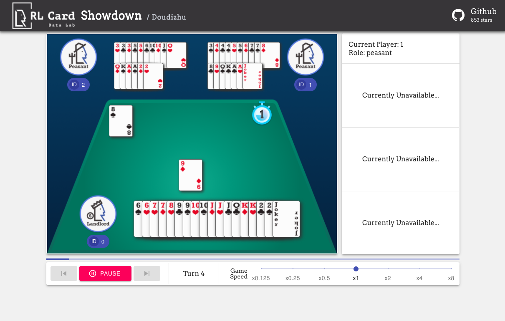

# Mini DDZ

这是一个基于 [DouZero](https://github.com/kwai/DouZero) 的斗地主（Dou Dizhu）PvE（人机对战）演示项目。前端使用 [React](https://reactjs.org/) 开发，后端基于 [Flask](https://flask.palletsprojects.com/)。

*   DouZero 项目: [https://github.com/kwai/DouZero](https://github.com/kwai/DouZero)
*   在线演示: [https://www.douzero.org/](https://www.douzero.org/)

## 功能特性

### 1. PvE 模式（人机对战）
与 DouZero AI 进行斗地主对战：
- 选择角色：地主、地主上家或地主下家
- 实时 AI 预测和胜率估计
- 可调节的游戏速度
- 游戏统计追踪
- 支持中英文切换

### 2. 回放模式
观看 AI 对战回放：
- 自动生成 DouZero AI 对战回放
- 支持步进播放和速度控制
- 查看 AI 预测动作和预期胜率
- 暂停、恢复和浏览游戏历史

## 安装

项目采用前后端分离架构。

### 前置要求

**前端**：需要安装 [Node.js](https://nodejs.org/) 和 NPM。通常只需手动安装 Node.js，NPM 会随 Node.js 自动安装。

验证安装：
```bash
node -v
npm -v
```

**后端**：需要 **Python 3.9+**。项目使用 [uv](https://github.com/astral-sh/uv) 进行 Python 包管理。

### 安装前后端依赖

1. 进入项目目录：
```bash
cd mini-ddz
```

2. 安装前端依赖：
```bash
npm install
```

3. 安装 Python 依赖（使用 uv）：
```bash
uv sync
```

或使用 pip：
```bash
pip install -e .
```

## 运行项目

1. 启动 PvE 服务器（Flask 后端）：
```bash
cd pve_server
python run_douzero.py
```

后端将运行在 [http://127.0.0.1:5000/](http://127.0.0.1:5000/)。

2. 在另一个终端启动前端：
```bash
npm start
```

应用将运行在 [http://127.0.0.1:3000/](http://127.0.0.1:3000/)。

**可用页面：**
- PvE 演示（人机对战）：[http://127.0.0.1:3000/](http://127.0.0.1:3000/) 或 [http://127.0.0.1:3000/pve/doudizhu-demo](http://127.0.0.1:3000/pve/doudizhu-demo)
- AI 回放：[http://127.0.0.1:3000/replay/doudizhu](http://127.0.0.1:3000/replay/doudizhu)

## 项目结构

```
mini-ddz/
├── src/                    # React 前端源代码
│   ├── components/         # React 组件
│   ├── view/              # 页面视图（PvE、回放）
│   ├── utils/             # 工具函数和配置
│   ├── locales/           # 国际化翻译（en、zh）
│   └── assets/            # 静态资源（图片、样式）
├── pve_server/            # Flask PvE 后端
│   ├── run_douzero.py     # Flask 主服务器
│   ├── deep.py            # 深度学习模型包装器
│   ├── models.py          # 模型定义
│   ├── utils/             # 游戏逻辑工具
│   │   ├── move_generator.py   # 动作生成器
│   │   ├── move_detector.py    # 动作类型检测
│   │   ├── move_selector.py    # 动作筛选器
│   │   └── utils.py            # 通用工具
│   ├── pretrained/        # 预训练模型
│   │   └── douzero_pretrained/ # DouZero 预训练模型
│   └── replays/           # 回放数据存储
├── docs/                  # 文档
│   ├── README.md          # 文档索引
│   ├── guide.md           # 用户指南
│   └── api.md             # API 文档
├── public/                # 静态资源
├── package.json           # NPM 依赖配置
└── pyproject.toml         # Python 项目配置
```

## API 接口

Flask 后端提供以下接口：

| 接口 | 方法 | 描述 |
|----------|--------|-------------|
| `/predict` | POST | 获取当前游戏状态的 AI 预测 |
| `/legal` | POST | 获取给定手牌和对手动作的可行动作 |
| `/generate_replay` | GET | 生成新的 AI 对战回放 |
| `/replay/<replay_id>` | GET | 根据 ID 获取回放数据 |
| `/list_replays` | GET | 列出所有可用回放 |

详细 API 文档请参见 [docs/api.md](docs/api.md)。

## 技术栈

- **前端**: React 16.x, Material-UI, i18next, Socket.io-client
- **后端**: Flask, Flask-CORS
- **AI 推理**: PyTorch, ONNX Runtime
- **包管理**: NPM (前端), uv (Python)

## 演示截图



## 引用 DouZero

如果在研究中使用本项目，请引用 DouZero 论文：

```bibtex
@article{zha2021douzero,
  title={DouZero: Mastering DouDizhu with Self-Play Deep Reinforcement Learning},
  author={Zha, Daochen and Xie, Jingru and Ma, Wenye and Zhang, Sheng and Lian, Xiangru and Hu, Xia and Liu, Ji},
  journal={arXiv preprint arXiv:2103.00239},
  year={2021}
}
```

## 联系我们

如有问题或反馈，欢迎在 GitHub 上提交 Issue。

## 致谢

感谢 JJ World Network Technology Co., LTD 的慷慨支持，[Chieh-An Tsai](https://anntsai.myportfolio.com/) 的用户界面设计，以及 [Lei Pan](https://github.com/lpan18) 在可视化方面的帮助。
